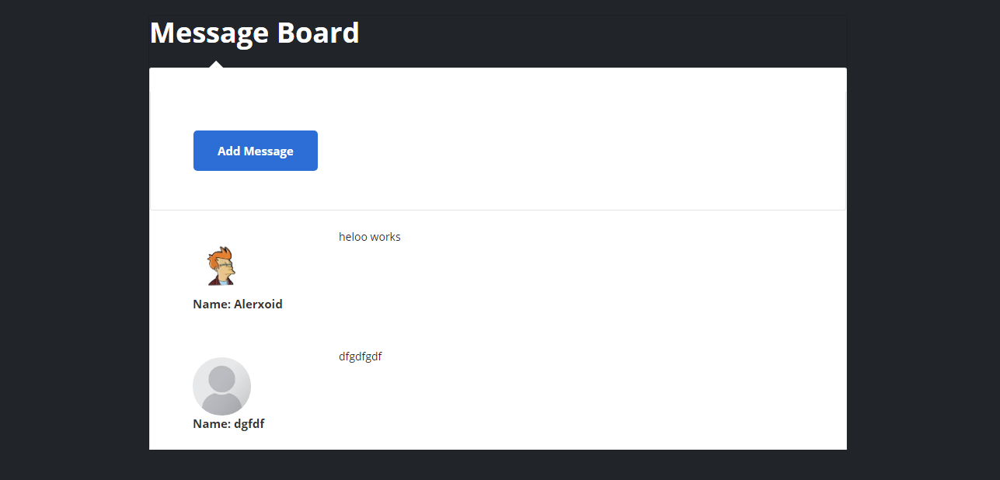
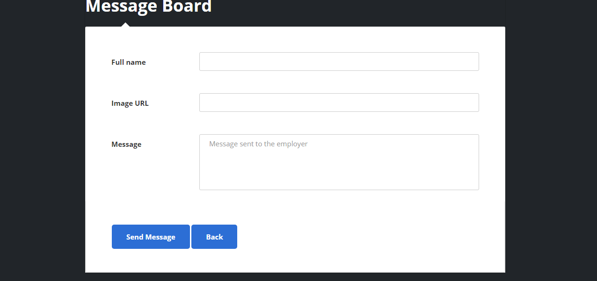

# Message Board
 Write a message use mongo database to store message.

## Built With

- JavaScript
- Express
- Mongodb
- Mongoose
- Ejs

## Live Demo
[Live Demo Link](https://Message-Board.alexoid.repl.c)
 

### Prerequisites

Browser
Internet
Node

## Getting Started

To get a local copy up and running follow these simple example steps:

- Go to https://github.com/Alexoid1/Message-Board and clone the repo using:  
`https://github.com/Alexoid1/Message-Board.git` in your terminal.

### Github Actions

To make sure the linters' checks using Github Actions work properly, you should follow the next steps:

1. On your recently forked repo, enable the GitHub Actions in the Actions tab.
2. Create the `feature/branch` and push.
3. Start working on your milestone as usual.
4. Open a PR from the `feature/branch` when your work is done.

## Authors

👤 **Pablo Alexis Zambrano Coral**
- Github: [@Alexoid1](https://github.com/Alexoid1)
- Twitter: [@Alexis Zambrano_acz](https://twitter.com/pablo_acz)
- Linkedin: [linkedin](https://www.linkedin.com/in/alexzambranocoral/)

## 🤝 Contributing

Contributions, issues and feature requests are welcome!

Feel free to check the [issues page](https://github.com/Alexoid1/Message-Board/issues).

## Show your support

Give a ⭐️ if you like this project!

## Acknowledgments

- The Odin Project

## 📝 License

This project is [MIT]() licensed.
